# 🔍 Awesome AI Search Assistant 🤖

  

  
  
  
  
  

> **Curated directory of AI-Powered Web Search Engines, Perplexity Alternatives, Cited Answer Assistants, Deep Research Agents & Local RAG Frameworks.**

---

## 📌 Table of Contents

- [📊 Market Overview & Sector Analysis](#-market-overview--sector-analysis)
- [🌐 SaaS / Hosted Platforms](#-saas--hosted-platforms)
- [⚡ Open-Source GitHub Projects](#-open-source-github-projects)
- [🛠️ Search Infrastructure & RAG Frameworks](#-search-infrastructure--rag-frameworks)
- [🤝 How to Contribute](#-how-to-contribute)
- [💖 Support & Sponsorship](#-support--sponsorship)
- [⚠️ Disclaimer](#%EF%B8%8F-disclaimer)
- [📈 Star History](#-star-history)

---

## 📊 Market Overview & Sector Analysis

> **Market Size & Growth**: The global AI Search Assistant & Deep Research market is estimated at **$3.5 Billion in 2026** and is projected to expand at a CAGR of **38.5%**, surpassing **$14.2 Billion by 2030**.  
> **Market Structure & Fragmentation**: The market is **moderately fragmented**, exhibiting a dual-layer competition structure. While top consumer search entry points follow a *winner-takes-most* model led by tech giants (Microsoft Copilot, Google AI Overviews) and category creators (Perplexity AI), specialized domains (academic research, developer code search, privacy-first local search) and self-hosted open-source alternatives remain highly active and diverse.

---

## 🌐 SaaS / Hosted Platforms

| Product | Description | Starting Pricing Tier | Free Tier Limits |
| :--- | :--- | :--- | :--- |
| **[Perplexity AI](https://www.perplexity.ai/)** ⚡ | Category-defining AI search assistant providing cited web answers with focus modes. | **$20/month** (Pro plan) | Free forever (Unlimited standard searches, ~5 Pro searches/day). |
| **[Microsoft Copilot in Bing](https://www.bing.com/copilot)** 🌐 | AI search assistant integrated into Bing powered by GPT-4 and web search. | **$9.99/month** (via Microsoft 365 Personal/Premium) | Free forever (Web search, chat, & Bing image creation with rate caps). |
| **[Google Search Generative Experience (SGE)](https://labs.google/sge/)** 🔍 | Google's AI-powered search overviews and interactive AI mode. | **$19.99/month** (via Google One AI Premium for advanced AI features) | Free forever (Integrated AI Overviews directly in Google Search with no query caps). |
| **[You.com](https://you.com/)** 🤖 | AI search platform offering specialized research agents and developer APIs. | **$5.00 / 1k API calls** (Search API) / **$20/month** (Pro plan) | Free trial with **$100 free API credits** upon signup. |
| **[Andi Search](https://andisearch.com/)** 🛡️ | Privacy-focused AI search assistant with no tracking or ads. | **$49/month** (Developer API Team plan) | Free forever (Unlimited privacy-focused web search). |
| **[Phind](https://www.phind.com/)** 💻 | AI search engine optimized for software developers with code generation. | **$10/month** (Phind Plus) / **$20/month** (Phind Pro) | Free forever (Unlimited Phind Fast searches, 50 Phind Large searches/day). |
| **[Komo AI](https://komo.ai/)** 🚀 | AI search assistant focused on concise, fast cited answers. | **$8/month** (Basic) / **$20/month** (Standard) | Free forever (Access to Chat, Search, and Explore modes with basic daily query caps). |
| **[Brave Search AI](https://search.brave.com/)** 🦁 | Brave's privacy-centric search summarizer and browser AI assistant. | **$14.99/month** (Brave Leo Premium) / **$5 per 1k calls** (Search API) | Free forever (Unlimited web search & basic Leo AI; $5/month recurring free API credits). |
| **[Consensus](https://consensus.app/)** 🔬 | AI search engine for peer-reviewed scientific and academic research. | **$20/month** ($12/mo billed annually for Pro plan) | Free forever (Unlimited basic paper searches, 10 Pro messages/month, 3 Deep reviews/month). |
| **[Metaphor (Exa AI)](https://metaphor.systems/)** 🧠 | Neural search engine finding web content by semantic description. | **$5.00 / 1k requests** (Pay-as-you-go API) | Free trial with **$10 monthly recurring API credits** upon signup. |

---

## ⚡ Open-Source GitHub Projects

Sorted by GitHub_Stars (Descending) 🌟

1. **[Khoj](https://github.com/khoj-ai/khoj)**  🧠  
   **Self-hostable AI second brain with 37,000+ GitHub_Stars.** **AGPL-3.0 licensed**.  
   *Key features*: Connects to docs and web; builds autonomous agents; schedules background automations; deep research with verifiable citations.  
   *Best for*: Users wanting a personal AI assistant combining local knowledge base with live web search.

2. **[Vane (formerly Perplexica)](https://github.com/ItzCrazyKns/Vane)**  🚀  
   **The most popular open-source Perplexity alternative with 20,000+ GitHub_Stars.** **MIT licensed**.  
   *Key features*: Bundled SearxNG metasearch; Multi-LLM provider support (OpenAI, Anthropic, Gemini, Groq, Ollama, LM Studio); 6 Focus modes; File uploads & streaming cited answers; Deep research mode.  
   *Deployment*: Single Docker container (`itzcrazykns1337/vane:latest`) with embedded Next.js + SearxNG + SQLite.

3. **[Scira (formerly MiniPerplx)](https://github.com/zaidmukaddam/scira)**  ⚡  
   **Minimalist AI-powered search engine with 11,800+ GitHub_Stars.** Powered by **Vercel AI SDK**.  
   *Key features*: Streaming cited answers, minimalist high-speed interface, custom LLM selection.  
   *Best for*: Developers wanting a clean, modern TypeScript AI search application.

4. **[Farfalle](https://github.com/rashadphz/farfalle)**  🦋  
   **Self-hostable AI search engine with local or cloud LLM support with 3,500+ GitHub_Stars.** **Apache-2.0 licensed**.  
   *Key features*: Integrates with OpenAI, Groq, and Ollama; SearXNG backend; streaming web answers.

5. **[Lepton Search](https://github.com/leptonai/search)**  💡  
   **Conversational AI search engine template built with Lepton AI with 3,200+ GitHub_Stars.**  
   *Key features*: Built in under 500 lines of Python code; fast responses; clean web interface.

6. **[MindSearch](https://github.com/OpenCompass/MindSearch)**  🧭  
   **Open-source AI search engine framework with 2,500+ GitHub_Stars.**  
   *Key features*: Multi-agent search architecture; deep Web research capabilities; graph-based query expansion.

7. **[meta-surfer](https://github.com/hun-meta/meta-surfer)**  🏄  
   **Self-hosted AI-powered web search engine with multi-provider LLM support with 1,200+ GitHub_Stars.**  
   *Key features*: SearXNG integration; supports OpenAI, Gemini, Anthropic, Grok, Z.AI; CLI, Node.js library & Next.js UI; Code execution via Piston sandbox.

8. **[MiniSearch](https://github.com/felladrin/MiniSearch)**  🔒  
   **Minimalist AI search that runs entirely inside your browser with 800+ GitHub_Stars.**  
   *Key features*: Local LLM inference via WebLLM (WebGPU) or Wllama (CPU); SearXNG metasearch; ONNX Runtime reranker; IndexedDB caching.

9. **[Sensei](https://github.com/jljeng/sensei)**  🥋  
   **Self-hosted AI search engine supporting local and cloud LLMs with 500+ GitHub_Stars.** **Apache-2.0 licensed**.  
   *Key features*: SearXNG metasearch; OpenAI / Anthropic / Local LLM support.

10. **[Noodle](https://www.npmjs.com/package/@dwk/noodle)** 🍜  
    **Self-hosted CLI & browser search engine using LLMs for relevance ranking.**  
    *Key features*: Classic Google UI feel; Claude CLI / OpenAI integration; default browser engine replacement.

---

## 🛠️ Search Infrastructure & RAG Frameworks

- **[SearXNG](https://github.com/searxng/searxng)**  — Privacy-respecting metasearch engine used as the primary retriever by most open-source AI search tools.
- **[Qdrant](https://github.com/qdrant/qdrant)**  — Vector database & vector search engine for high-performance retrieval-augmented generation.
- **[Weaviate](https://github.com/weaviate/weaviate)**  — Open-source vector database supporting hybrid search (keyword + vector).
- **[Meilisearch](https://github.com/meilisearch/meilisearch)**  — Lightning-fast, hyper-relevant instant search engine.

---

## 🤝 How to Contribute

Contributions are warmly welcomed! Help keep this awesome list comprehensive and updated.

1. Fork this repository.
2. Add or update entries in `README.md` following the established format.
3. Ensure links are working and information is accurate.
4. Submit a Pull Request with a clear description of your changes.

Check out [Awesome-Awesome-Awesome](https://github.com/ishandutta2007/Awesome-Awesome-Awesome) for more curated lists! 🌟

---

## 💖 Support & Sponsorship

Thank you for visiting and using **Awesome AI Search Assistant**! If you find this repository helpful, please consider supporting the project:

- ⭐ **Star this repository** to help others discover it.
- 🍴 **Fork & Share** it with your developer and research networks.
- ☕ **Buy me a coffee**: If you'd like to support ongoing maintenance and research, consider sponsoring via [GitHub Sponsors](https://github.com/sponsors/ishandutta2007).

  

---

## ⚠️ Disclaimer

- This list is **community-curated** for educational and research purposes.
- Always review security policies and data retention terms before sending sensitive queries to cloud-hosted LLMs.
- Commercial search platforms provide managed infrastructure and global web index coverage, while open-source self-hosted solutions offer complete privacy and customization control.

---

## 📈 Star History

